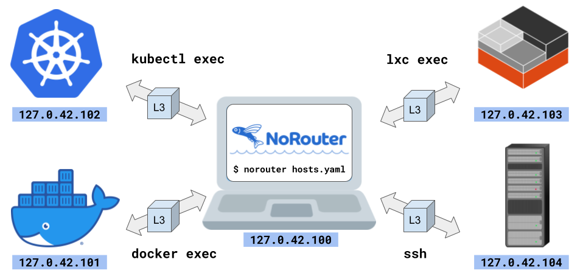

# [NoRouter](https://norouter.io/) (IP-over-Stdio): Unprivileged instant multi-cloud networking

[NoRouter](https://norouter.io/) is the easiest multi-host & multi-cloud networking ever:
- Works with any container, any VM, and any baremetal machine, on anywhere, as long as the shell access is available (e.g. `docker exec`, `kubectl exec`, `ssh`)
- Omnidirectional port forwarding: Local-to-Remote, Remote-to-Local, and Remote-to-Remote
- No routing configuration is required
- No root privilege is required (e.g. `sudo`, `docker run --privileged`)
- No public IP is required
- Provides several network modes
  - Loopback IP mode (e.g. 127.0.42.101, 127.0.42.102, ...)
  - HTTP proxy mode with built-in name resolver
  - SOCKS4a and SOCKS5 proxy mode with built-in name resolver
- Easily installable with a single binary, available for Linux, macOS, BSDs, and Windows

Web site: https://norouter.io/

- - -

<!-- START doctoc generated TOC please keep comment here to allow auto update -->
<!-- DON'T EDIT THIS SECTION, INSTEAD RE-RUN doctoc TO UPDATE -->


- [What is NoRouter?](#what-is-norouter)
- [Download](#download)
- [Quick usage](#quick-usage)
- [Documentation](#documentation)
- [Installing NoRouter from source](#installing-norouter-from-source)
- [Contributing to NoRouter](#contributing-to-norouter)

<!-- END doctoc generated TOC please keep comment here to allow auto update -->

## What is NoRouter?

NoRouter implements unprivileged networking by using multiple loopback addresses such as 127.0.42.101 and 127.0.42.102.
The hosts in the network are connected by forwarding packets over stdio streams like `docker exec`, `kubectl exec`, `ssh`, and whatever.

Unlike traditional port forwarders such as `docker run -p`, `kubectl port-forward`, `ssh -L`, and `ssh -R`,
NoRouter provides mutual interconnectivity across multiple remote hosts.



NoRouter is mostly expected to be used in a dev environment for running heterogeneous multi-cloud apps.

e.g. An environment that is composed of:
- A laptop in the living room, for writing codes
- A baremetal workstation with GPU/FPGA in the office, for running machine-learning workloads
- ACI (Azure Container Instances) containers, for running other workloads that do not require a complete Kubernetes cluster
- EKS (Amazon Elastic Kubernetes Service) pods, for workloads that heavily access Amazon S3 buckets
- GKE (Google Kubernetes Engine) pods, for running gVisor-armored workloads

For production environments, setting up VPNs rather than NoRouter would be the right choice.

## Download

The binaries are available at https://github.com/norouter/norouter/releases .

See also [Getting Started](https://norouter.io/docs/getting-started/).

## Quick usage

- Install the `norouter` binary to all the hosts. Run `norouter show-installer` to show an installation script.
- Create a manifest YAML file. Run `norouter show-example` to show an example manifest.
- Run `norouter <FILE>` to start NoRouter with the specified manifest YAML file.

An example manifest file:
```yaml
hosts:
# localhost
  local:
    vip: "127.0.42.100"
# Docker & Podman container (docker exec, podman exec)
  docker:
    cmd: "docker exec -i some-container norouter"
    vip: "127.0.42.101"
    ports: ["8080:127.0.0.1:80"]
# Kubernetes Pod (kubectl exec)
  kube:
    cmd: "kubectl --context=some-context exec -i some-pod -- norouter"
    vip: "127.0.42.102"
    ports: ["8080:127.0.0.1:80"]
# LXD container (lxc exec)
  lxd:
    cmd: "lxc exec some-container -- norouter"
    vip: "127.0.42.103"
    ports: ["8080:127.0.0.1:80"]
# SSH
# If your key has a passphrase, make sure to configure ssh-agent so that NoRouter can login to the remote host automatically.
  ssh:
    cmd: "ssh some-user@some-ssh-host.example.com -- norouter"
    vip: "127.0.42.104"
    ports: ["8080:127.0.0.1:80"]
```

In the above example, 127.0.42.101:8080 on each host is forwarded to the port 80 of the Docker container.

Try:

```console
$ curl http://127.0.42.101:8080
$ docker exec some-container curl http://127.0.42.101:8080
$ kubectl --context=some-context exec some-pod -- curl http://127.0.42.101:8080
$ lxc exec some-container -- curl http://127.0.42.101:8080
$ ssh some-user@some-ssh-host.example.com -- curl http://127.0.42.101:8080
```

Similarly, 127.0.42.102:8080 is forwarded to the port 80 of the Kubernetes Pod,
127.0.42.103:8080 is forwarderd to the port 80 of the LXD container,
and 127.0.42.104:8080 is forwarded to the port 80 of `some-ssh-host.example.com`.

See [Documentation](#documentation) for the further information,
such as HTTP proxy mode and SOCKS proxy mode.

## Documentation

- [Top](https://norouter.io/docs/)
- [Getting Started](https://norouter.io/docs/getting-started/)
- [Examples](https://norouter.io/docs/examples/)
- [Troubleshooting](https://norouter.io/docs/troubleshooting/)
- [Command reference](https://norouter.io/docs/command-reference/)
- [YAML reference](https://norouter.io/docs/yaml-reference/)
- [How it works](https://norouter.io/docs/how-it-works/)
- [Roadmap](https://norouter.io/docs/roadmap/)
- [Similar projects](https://norouter.io/docs/similar-projects/)

## Installing NoRouter from source

```console
$ make
$ sudo make install
```

## Contributing to NoRouter

- Please sign-off your commit with `git commit -s` and with your real name.
- Please add documents and tests whenever possible.

- - -

NoRouter is licensed under the terms of [Apache License, Version 2.0](./LICENSE).

Copyright (C) NoRouter authors.
